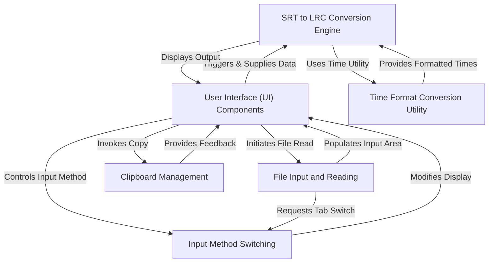
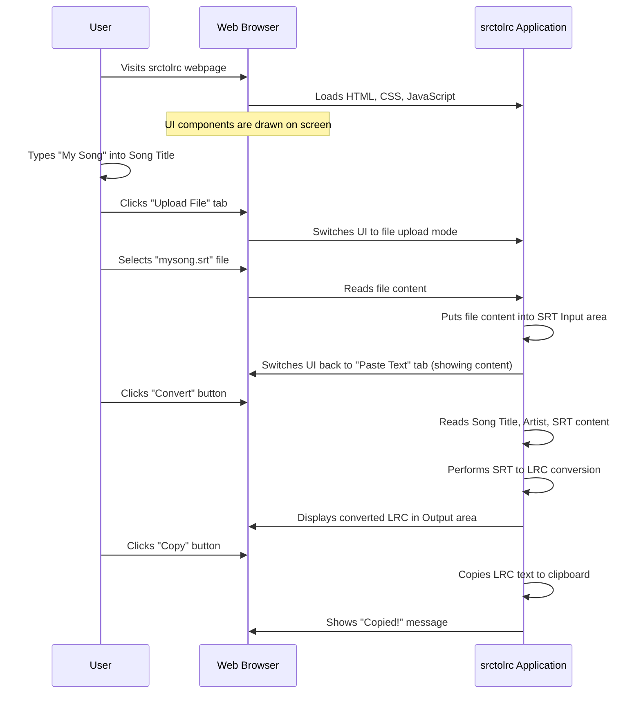

# Subtitle(.srt) to Lyric(.lrc) Converter
This project, `srctolrc`, is a helpful **web application** that easily converts *SRT subtitle files* into *LRC lyrics format*. Users can paste SRT text or upload a file, add song metadata, and then quickly generate and **copy** the synchronized LRC lyrics. It streamlines the process of preparing lyrics for music players.


## Visual Overview


Welcome to the exciting world of `srctolrc`! In this first chapter, we're going to start at the very beginning, by looking at what you actually *see* and *interact with* when you open the `srctolrc` web page. This is what we call the "User Interface" or "UI".

### What are UI Components?

Imagine driving a car. You have a steering wheel, pedals, a dashboard with speed and fuel gauges, buttons for lights, and a screen for navigation. All these parts – the dials, buttons, and displays – are there for you, the driver, to interact with and understand what the car is doing.

In the same way, a website also has a "dashboard" made of many pieces. These are all the visible elements and interactive parts of the web page that users see and click on. For our `srctolrc` project, these are things like:

*   Boxes where you type information (like the song title).
*   Big areas where you paste text or see the converted lyrics.
*   Buttons you click to make something happen (like "Convert" or "Copy").
*   Sections where you can upload a file.

These are all examples of UI Components. They are the building blocks of any website, allowing you to tell the computer what you want to do and see the results.

### Our Goal: Converting SRT to LRC

The main purpose of `srctolrc` is to help you easily convert subtitle files (SRT format) into lyric files (LRC format). Let's walk through how you'd use the UI components to achieve this.

1.  **You open the `srctolrc` web page.** You'll see all the UI components laid out.
2.  **You provide details about your song.** You might type the song title or artist into their respective boxes.
3.  **You give `srctolrc` your SRT content.** This is the crucial part! You can either paste the SRT text directly or upload an SRT file.
4.  **You click a button to start the conversion.**
5.  **`srctolrc` shows you the result.** The converted LRC text appears in a special output box.
6.  **You can then easily grab the converted LRC.** There's a button to copy it to your clipboard.

That's the basic flow, and it all happens through these friendly UI components!

### Key UI Components in `srctolrc`

Let's look at the specific UI components you'll find on the `srctolrc` page:

#### 1. Input Fields for Song Information

These are small boxes where you can type in details about your song.

*   **Song Title:** Where you type the name of the song.
*   **Artist:** Where you type the name of the artist.
*   **Length:** An optional field for the song's duration.

```html
<!-- Simplified HTML from index.html -->
<label for="songTitle">Song Title</label>
<input type="text" id="songTitle" placeholder="e.g., Bohemian Rhapsody">

<label for="artist">Artist</label>
<input type="text" id="artist" placeholder="e.g., Queen">

<label for="length">Length (Optional)</label>
<input type="text" id="length" placeholder="e.g., 05:55">
```

These `input` elements are like the "dials" on your car dashboard, allowing you to feed specific, small pieces of information into the system.

#### 2. SRT Input Section (Paste or Upload)

This is where you provide the actual SRT subtitle content. It has two ways (or "tabs") to give input:

*   **Paste Text Tab:** A large text area where you can paste your SRT content directly.
*   **Upload File Tab:** A section where you can click or drag and drop an SRT file from your computer.

```html
<!-- Simplified HTML from index.html -->
<ul class="flex" id="srtTab">
    <li><button id="paste-tab" type="button">Paste Text</button></li>
    <li><button id="upload-tab" type="button">Upload File</button></li>
</ul>

<div id="paste-content">
    <textarea id="srtInput" rows="12" placeholder="1\n00:00:01,000 --> 00:00:04,000\nIs this the real life?"></textarea>
</div>

<div id="upload-content" class="hidden">
    <input type="file" id="srtFileInput" accept=".srt">
    <label for="srtFileInput">
        <p>Click to upload or drag and drop</p>
        <p>SRT files only</p>
    </label>
    <p id="fileName"></p>
</div>
```

Here, the `textarea` is a bigger input area, like a notepad, while the `input type="file"` (hidden and styled with a `label`) is a special component to open your computer's file explorer. The `paste-tab` and `upload-tab` buttons allow you to switch between these two input methods. This interaction will be explored more in [Chapter 2: Input Method Switching](02_input_method_switching_.md).

#### 3. LRC Output Section

This is where you see the magic happen! After conversion, the generated LRC text appears here.

*   **LRC Output Area:** A large text area that displays the converted LRC.
*   **Copy Button:** A button next to the output area to quickly copy the LRC text.

```html
<!-- Simplified HTML from index.html -->
<label for="lrcOutput">LRC Output</label>
<button id="copyButton">Copy</button>
<textarea id="lrcOutput" rows="12" readonly></textarea>
```

The `textarea` here has the `readonly` attribute, meaning you can't type into it, only view the results. The `copyButton` is a simple button that triggers an action.

#### 4. The "Convert" Button

This is the most important button! After you've provided all the necessary input, clicking this button tells `srctolrc` to process your SRT content and generate the LRC.

```html
<!-- Simplified HTML from index.html -->
<button id="convertButton">
    Convert
</button>
```

This button is the "ignition" of our application, starting the core conversion process.

#### 5. Message Box

Sometimes, the application needs to give you quick feedback, like confirming that something was copied.

```html
<!-- Simplified HTML from index.html -->
<div id="messageBox">
    Copied to clipboard!
</div>
```

This `div` (a generic container) acts as a temporary message display, usually popping up and fading away.

### How it Works Behind the Scenes (Non-Code)

Let's imagine you, the user, want to convert an SRT file. Here's a simplified sequence of events:



This diagram shows how you interact with the Web Browser, and how the `srctolrc` application (which is JavaScript code running *inside* your browser) reacts to your clicks and inputs. The UI components are the bridge between you and the application.

### Internal Implementation (Code Walkthrough)

All these UI components are defined using **HTML** (HyperText Markup Language). HTML is like the blueprint for a webpage, telling the browser what elements to display and where. Each component usually has an `id` attribute, which is like a unique name tag. This allows our JavaScript code to easily find and interact with specific elements.

Let's look at a few examples from the `index.html` file:

```html
<!-- From index.html -->
<input type="text" id="songTitle" class="w-full ..." placeholder="e.g., Bohemian Rhapsody">
```
This is an `input` tag. The `type="text"` means it's for text input. The `id="songTitle"` gives it a unique identifier. The `class="w-full ..."` are styling instructions (using a library called Tailwind CSS, which just makes things look pretty). The `placeholder` text gives a hint of what to type.

```html
<!-- From index.html -->
<textarea id="srtInput" rows="12" class="w-full ..." placeholder="1\n00:00:01,000 --> 00:00:04,000\nIs this the real life?"></textarea>
```
This is a `textarea` tag, used for larger multi-line text input. `id="srtInput"` is its unique name. `rows="12"` suggests how tall it should be.

```html
<!-- From index.html -->
<button id="convertButton" class="bg-blue-600 ...">
    Convert
</button>
```
This is a `button` tag. `id="convertButton"` allows our JavaScript code to know when this specific button is clicked. The text "Convert" is what you see on the button.

In our JavaScript code (also found in `index.html` within `<script>` tags), we first "find" these elements using their `id`s:

```javascript
// --- DOM Element References ---
const songTitleInput = document.getElementById('songTitle');
const srtInput = document.getElementById('srtInput');
const convertButton = document.getElementById('convertButton');
const lrcOutput = document.getElementById('lrcOutput');
// ... other elements
```
`document.getElementById()` is a special JavaScript instruction that looks through the HTML document for an element with a specific `id`. Once found, we store a reference to it in a variable (like `songTitleInput`). Think of these variables as "remote controls" for each UI component.

Later, when you click the "Convert" button, our JavaScript code uses these "remote controls" to:

1.  Read what you've typed in `songTitleInput` and `srtInput` (using `.value`).
2.  Perform the conversion (we'll dive into this in [Chapter 4: SRT to LRC Conversion Engine](04_srt_to_lrc_conversion_engine_.md)).
3.  Display the result in `lrcOutput` (by setting its `.value`).

```javascript
// --- Event Listeners ---
convertButton.addEventListener('click', performConversion);

// --- Core Functions ---
function performConversion() {
    const srtText = srtInput.value.trim(); // Read content from srtInput textarea
    // ... conversion logic ...
    lrcOutput.value = lrcContent.join('\n'); // Display result in lrcOutput textarea
}
```
The `addEventListener('click', performConversion)` part means: "Hey `convertButton`, whenever someone clicks you, please run the `performConversion` function." This is how the UI components trigger actions in our application.

### Conclusion

In this chapter, you've learned that UI Components are the visible and interactive parts of a website. For `srctolrc`, these include input boxes for metadata, text areas for SRT and LRC, buttons for actions, and a file upload section. You've seen how these components are defined in HTML and how JavaScript uses their unique `id`s to interact with them, making the application responsive to your actions.

Understanding these building blocks is the first step to understanding any web application. Next, we'll dive deeper into how `srctolrc` handles the different ways you can provide your SRT content in [Chapter 2: Input Method Switching](02_input_method_switching_.md).

---

**References**: [[1]](https://github.com/itspabel/srctolrc/blob/017975198949b826d00f3987e0fe3961edb99c40/index.html)
